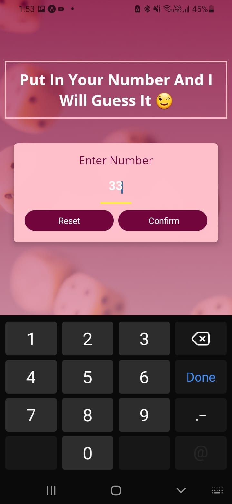
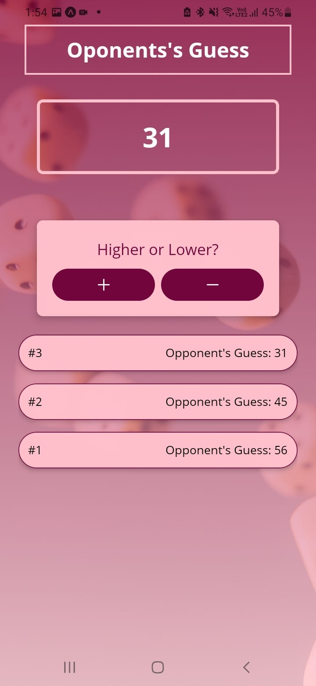
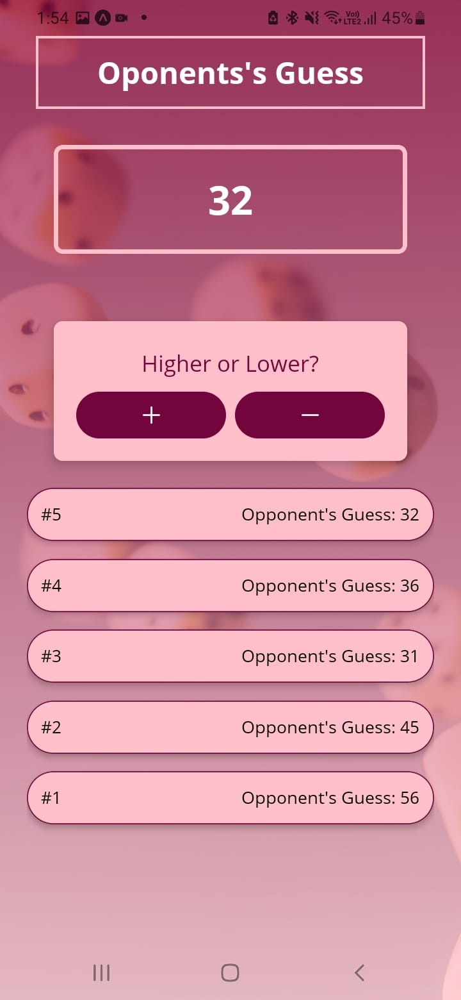
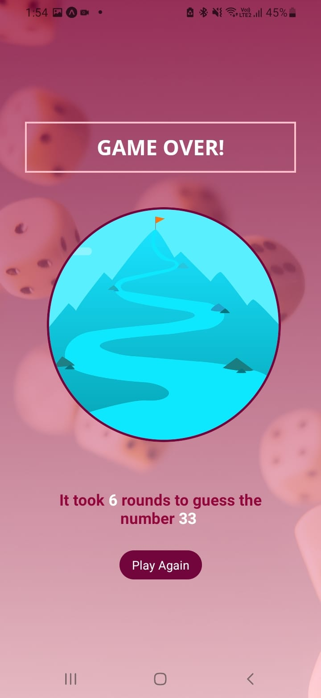

# I'll Guess Your Number

An interactive number guessing game where the **computer guesses the number you're thinking of**. You guide the game by telling the computer if its guess is too high or too low, and it keeps narrowing the range until it finds the correct number.

## 🔧 Tech Stack

- JavaScript
- Expo (React Native)

## 🕹️ How It Works

You think of a number, and the computer tries to guess it. After each guess, you tell it whether the number is higher or lower, and it keeps adjusting its guess accordingly until it gets it right.

The game also displays a history of previous guesses (e.g., *First guess: 50*, *Second guess: 75*, etc.).

This behavior is also shown clearly in the screenshots below.

## 📸 Screenshots

## 📚 Project Info

This project was created as part of a learning course for practice and gaining experience with JavaScript and mobile development using Expo.
